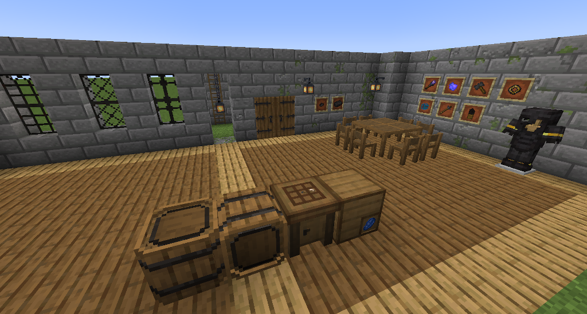
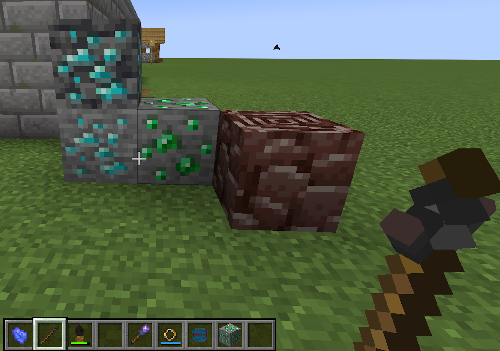
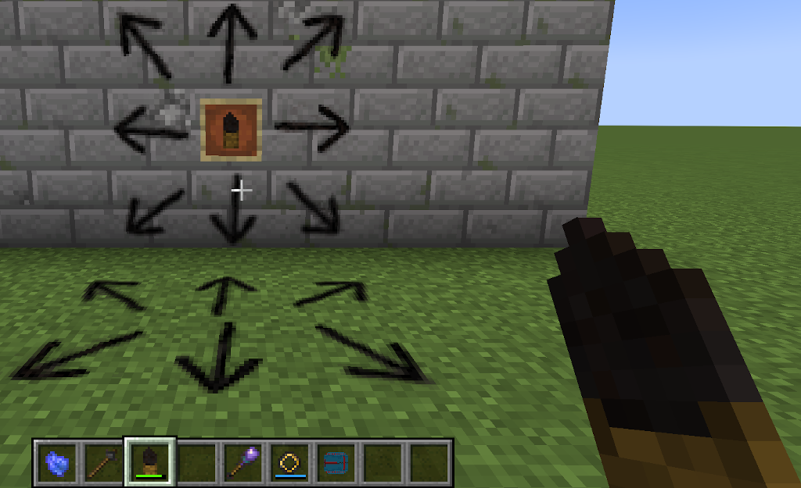

## WilE's Collection

A [Minecraft](https://minecraft.net) (Java Edition) mod based on
[`Forge`](http://www.minecraftforge.net/), adding a few blocks and
items to vanilla styled packs.

### Distribution file download

Main distribution channels for this mod are:

  - Curse Forge: https://www.curseforge.com/minecraft/mc-mods/wiles-collection/
  - Modrinth : https://modrinth.com/mod/wilescollection

----

### Blocks

- *Rustic Iron* composed deco blocks like lanterns, chains, windows.

- *Rustic Spruce styled Wood Door*: More "Castle-like" Spruce color scheme door.

- *Rustic Spruce styled wood table and chair* for interieur decoration.

- *Weathered Stone Bricks*: Slightly decayed/weathered looking Stone bricks with
  texture variations. Contains aspects of Stone Bricks, Mossy Stone Bricks, and
  Cracked Stone Bricks in a decent manner.

- *Wide Rung ladder*: Ladder with a 3D model (stripped Spruce style), climbing is
  faster than vanilla ladders when looking up/down while climbing/descending.

- *Crafting Table*: 3x3 crafting table with an additional inventory and some little
  tweaks.

- *Labeled Crate* A storage crate with 9x6 slots and a built-in item frame.

### Items

- *Ariadne Coal*: A coal pen that allows you to draw arrows on walls, floors
  and ceilings to find the way out of caves. Build like a "coal sword".

- *Tracking Compass*: Item that can be used and placed in your hotbar. It allows to find
  your friends (or other entities), and trace back to locations. Click a block or entity
  to set the tracking target. The built-in ball-compass will show you the way then (also
  up/down when you are close). If you or the tracked target is in another dimension, the
  compass shows this when you hover it in your inventory. Otherwise the distance is shown.

- *Prospecting Dowser*: A magical utility allowing you to find valuable resources a bit
  faster. When you hold it in the hand, it starts spinning when you get close to Diamond
  ore, Ancient Debris, and the like. The more you look into the right direction, and the
  closer you are, the faster is the rotational speed of the Dowser head.

- *Plated Netherite Armor*: A simple upgrade for the vanilla Netherite Armor - with a nice
  look, visibly gold decorated (Piglins), and with slightly higher rating and toughness.

- *Mind Squeezer* and *Charged Lapis*: Magical items that allows drawing XP from you
  and storing these XP levels in *Lapis Lazuli* (has to be in your inventory). The
  *Lapis* is converted into *Charged Lapis*, which can be consumed to get the XP levels
  back, but also being stored or shared between players. The Squeezer conversion is
  slightly lossy and only works if the player has more than 14 XP levels.

- *Peculiar Ring*: Magical ring that repairs your armor and held tool slowly from time to
  time. It has to be charged with Lapis Lazuli before it can be used. To do this, toss the
  ring on an Anvil (in-world, not in GUI), so that it locks in the center of the block,
  then toss Lapis on it. The ring shows it charge state as blue duration bar on the item.

### Notes

Some of the Blocks and items may be very well known from my Engineer's Decor and Engineer's
Tools mods. These features mostly moved from these mods and re-styled in a vanilla fashion,
mainly due to the change of the tech mod landscape (e.g. Immersive Engineering has now the
Engineer's Crafting table, so the Treated Wood Crafting Table/Metal Crafting table is not
needed anymore in the Engineer's Decor mod).

### Images

